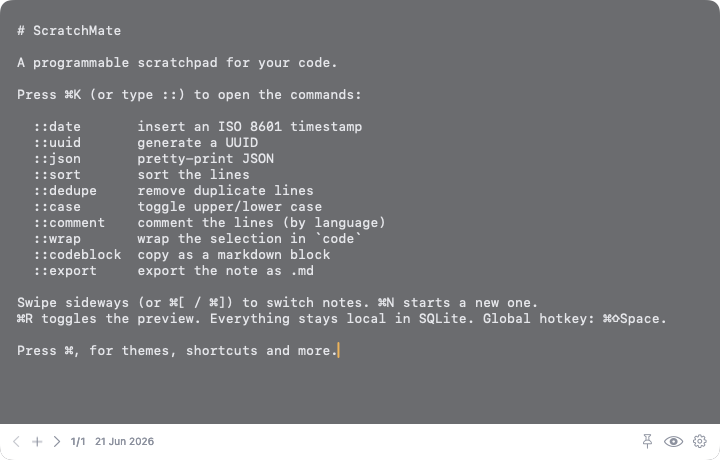
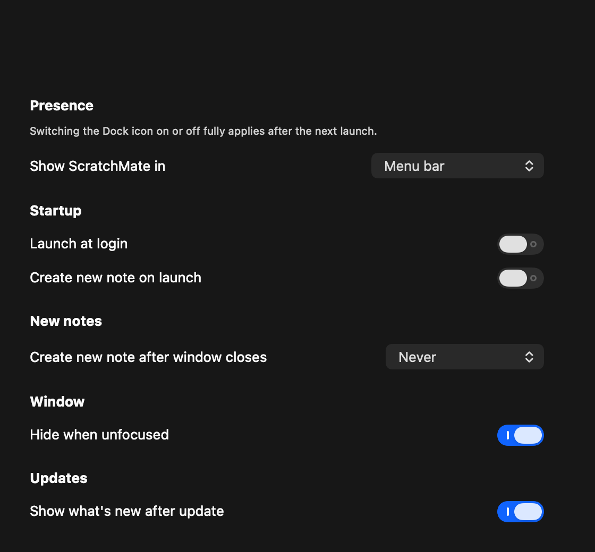

<!-- readme-padrao:header -->
<!-- Banner -->
<div align="center">
  
</div>

<!-- Typing -->
<div align="center">
  
</div>

<div align="center">

  <br>
  

  <br>
  
  <br><br>

  <p>The mental lightness of <a href="https://antinote.io">Antinote</a> with the workbench soul of <a href="https://macromates.com/">TextMate</a>: throwaway notes, navigable by swipe, with <code>::</code> commands and live format preview.</p>

  <p>
    <a href="LICENSE"></a>
    
    <a href="https://github.com/leonardocandiani/scratchmate/releases"></a>
    <a href="https://github.com/leonardocandiani/scratchmate/actions/workflows/build-check.yml"></a>
    <a href="https://github.com/leonardocandiani/scratchmate/pulls"></a>
  </p>

  <p>
    <a href="#features">Features</a> •
    <a href="#install">Install</a> •
    <a href="#shortcuts">Shortcuts</a> •
    <a href="#build-from-source">Build from source</a> •
    <a href="#acknowledgments">Acknowledgments</a> •
    <a href="#project">Project</a> •
    <a href="#license">License</a>
  </p>
</div>

<br>

> **ScratchMate** opens instantly from a global hotkey and hands you a buffer that understands code. Write, transform with `::` commands, swipe to the next note, throw it away. Nothing you type leaves your Mac.

## What it is

```yaml
product:  ephemeral scratchpad for developers, native to macOS
platform: macOS 14+, Swift + AppKit, Liquid Glass on macOS 26
open:     global hotkey, menu bar app, no Dock icon
commands: :: text commands (format, transform, preview) inside the buffer
storage:  local SQLite only, no account, no cloud, no sync
install:  Homebrew cask or signed DMG from Releases
license:  MIT
```

<!-- /readme-padrao:header -->

ScratchMate opens instantly from a global hotkey and hands you a throwaway buffer
that understands code. It lives in the menu bar, has no account and no cloud, and
nothing you write leaves your Mac. Everything is local in SQLite. The capture is
native Swift on AppKit, the glass is the system material, and the whole thing is
designed to disappear the moment you stop typing.

## Features

- **Ephemeral note deck (Antinote style).** A floating window that opens on a hotkey, hides on blur, and saves itself. Swipe two fingers sideways (or `Cmd+[` / `Cmd+]`) to move through notes; swiping past the newest creates a fresh one.
- **Command palette (`::` or `Cmd+K`)** with native text commands: insert date, UUID, format JSON, sort lines, dedupe, case transform, comment lines, wrap selection, copy as code block, export markdown.
- **Find across all notes (`Cmd+F`)** with a search bar that filters every note as you type.
- **Live preview (`Cmd+R`)** of markdown, JSON and code by language.
- **Native look.** Liquid Glass material (with a graceful fallback below macOS 26), eight themes, adjustable translucency, hover reveal chrome, and full respect for Reduce Transparency, Reduce Motion and Increase Contrast.
- **Local first.** Notes live in SQLite with optional auto expiration. No account, no telemetry, no cloud.
- **Global hotkey** via Carbon, so it needs no Accessibility permission.

## Install

### Homebrew (cask)

```bash
brew install --cask leonardocandiani/tap/scratchmate
```

### Download

Grab the latest `.dmg` from [Releases](https://github.com/leonardocandiani/scratchmate/releases), open it, and drag ScratchMate to Applications.

ScratchMate is ad-hoc signed (not notarized yet). If macOS blocks the first launch:

```bash
xattr -rd com.apple.quarantine /Applications/ScratchMate.app
```

## Shortcuts

| Shortcut | Action |
|---|---|
| <kbd>Cmd</kbd><kbd>Shift</kbd><kbd>Space</kbd> | Toggle the window |
| <kbd>Cmd</kbd><kbd>K</kbd> | Command palette |
| <kbd>Cmd</kbd><kbd>F</kbd> | Find across notes |
| <kbd>Cmd</kbd><kbd>R</kbd> | Toggle preview |
| <kbd>Cmd</kbd><kbd>[</kbd> | Older note |
| <kbd>Cmd</kbd><kbd>]</kbd> | Newer note |
| <kbd>Cmd</kbd><kbd>N</kbd> | New note |
| <kbd>Cmd</kbd><kbd>P</kbd> | Pin to screen |
| <kbd>Cmd</kbd><kbd>,</kbd> | Settings |

You can also type `::` anywhere to open the command palette inline.

## Build from source

```bash
swift build
swift test --scratch-path .build-cli   # 49 tests
./Scripts/make-app.sh debug
open dist/ScratchMate.app
```

ScratchMate references macOS 26 symbols (`NSGlassEffectView`) for Liquid Glass,
guarded at runtime with `if #available(macOS 26, *)` and falling back to
`NSVisualEffectView`. Building requires the macOS 26 SDK (Xcode 26); the minimum
deployment target stays at macOS 14.

## Acknowledgments

- [Antinote](https://antinote.io) for the ephemeral, hotkey-first scratchpad model.
- [TextMate](https://macromates.com/) for treating text as a programmable surface.
- [Krit](https://github.com/leonardocandiani/krit) for the native macOS OSS scaffolding.

## Project

- [Contributing](CONTRIBUTING.md) for how to set up, build and send changes.
- [Code of Conduct](CODE_OF_CONDUCT.md) for community expectations.
- [Security policy](SECURITY.md) for reporting vulnerabilities.
- [Changelog](CHANGELOG.md) for release notes.
- [Third party notices](THIRD_PARTY_NOTICES.md) for bundled dependencies.

## License

MIT. See [LICENSE](LICENSE).

<!-- readme-padrao:footer -->
<br>

---

<div align="center">
  <p><strong>Built by <a href="https://github.com/leonardocandiani">Leonardo Candiani</a></strong> · More projects at <a href="https://github.com/leonardocandiani?tab=repositories">github.com/leonardocandiani</a></p>
  <p>Leonardo Candiani builds AI agents that talk, decide and close deals. Cofounder of SixQuasar, operating Proteauto, SegSmart and IACall end to end.</p>
  <a href="https://leonardocandiani.com.br">
    
  </a>
  <a href="https://github.com/leonardocandiani">
    
  </a>
  <a href="https://instagram.com/leonardocandiani">
    
  </a>
  <a href="https://youtube.com/@oleonardocandiani">
    
  </a>
</div>

<br>

<div align="center">
  
</div>
<!-- /readme-padrao:footer -->
